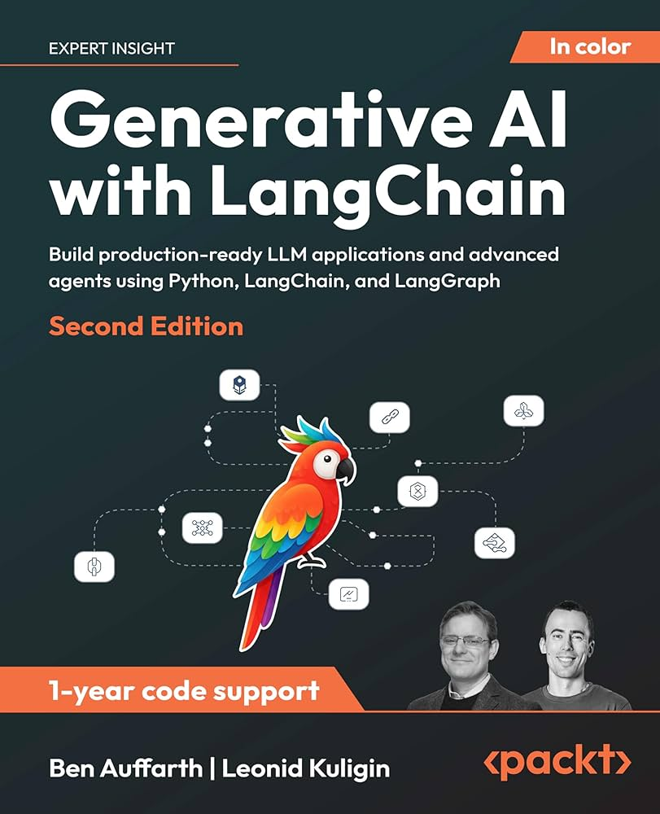

# LangChain Book Projects 📘



This repository contains code examples, exercises, and projects based on the book:

📖 **Generative AI with LangChain**  
[Buy the book](https://www.packtpub.com/en-us/product/generative-ai-with-langchain-9781837022007)


It is a hands-on resource to help you master LangChain for building intelligent applications using LLMs.

---

## 📂 Chapters

In the following table, you can find links to the directories in this repository. Each directory contains further links to Python scripts.

| Chapter    | Title                                                       | Directory Link | Status       |
|------------|-------------------------------------------------------------|----------------|--------------|
| Chapter 1  | The Rise of Generative AI: From Language Models to Agents   | Not Needed | Not Needed  |
| Chapter 2  | First Steps with LangChain                                  | [chapter2/](chapter2/) | ✅ Available |
| Chapter 3  | Building Workflows with LangGraph                           | [chapter3/](chapter3/) | ✅ Available |
| Chapter 4  | Building Intelligent RAG Systems with LangChain             | [chapter4/](chapter4/) | Coming soon  |
| Chapter 5  | Building Intelligent Agents                                  | [chapter5/](chapter5/) | Coming soon  |
| Chapter 6  | Advanced Applications and Multi-Agent Systems               | [chapter6/](chapter6/) | Coming soon  |
| Chapter 7  | Software Development and Data Analysis Agents               | [chapter7/](chapter7/) | Coming soon  |
| Chapter 8  | Evaluation and Testing of LLM Applications                  | [chapter8/](chapter8/) | Coming soon  |
| Chapter 9  | Production Deployment and Observability                     | [chapter9/](chapter9/) | Coming soon  |

---

## 🚀 Getting Started

To run any chapter’s code examples:

1. Set up a virtual environment:

   ```bash
   python -m venv venv
   venv\Scripts\activate   # On Windows

2. Install dependencies:
   ```bash
   pip install -r requirements.txt

3. Create a .env file in the root directory with your API keys:
   ```env
   OPENAI_API_KEY=your-api-key-here
   GOOGLE_API_KEY=""

5. Run a script:
   ```bash
   python chapter2/your_script.py

